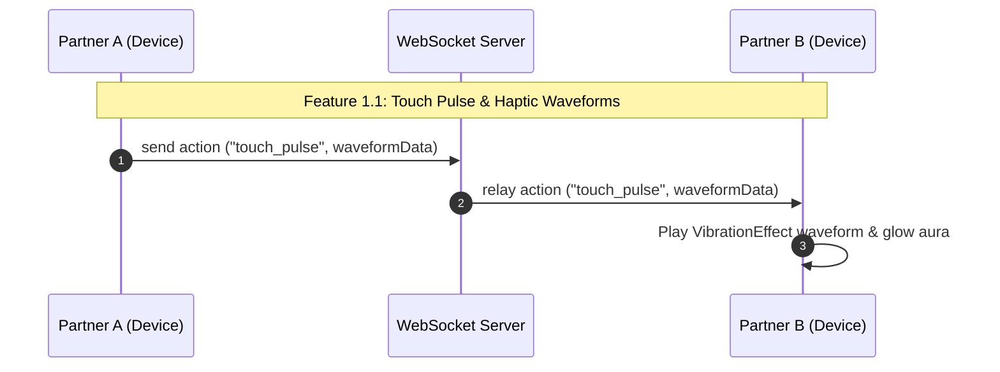
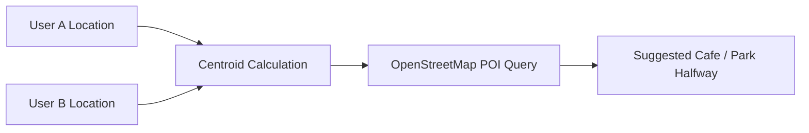
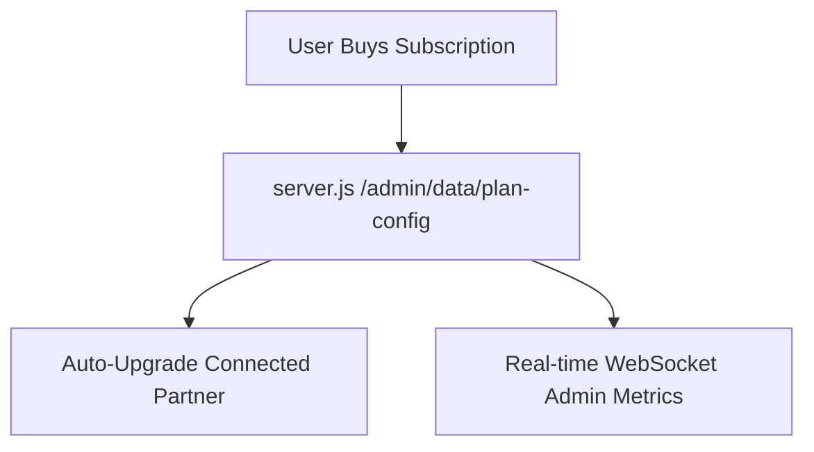

# 🚀 Gigi App: Comprehensive Feature Roadmap & Technical Implementation Plan

## 📌 Executive Summary

This document outlines the next-generation feature roadmap for **Gigi** — the intimate couple & social connection app. The proposed features build directly upon Gigi's existing core technology stack:

- **Android Client**: Jetpack Compose, CameraX, SensorManager, AudioRecord, Godot 3D integration, and `AppUpdateManager` (OTA engine).
- **Real-Time Sync Engine**: WebSocket protocol (`wss://gigi.iamanraj.com/ws`), `ScribbleSyncManager`, and `LiveEventBus`.
- **Live Nearby Engine**: `live_routes.js` with geo-fuzzed privacy, MongoDB `$geoNear` spatial indexing, and `LiveTrackingService`.
- **Monetization & Admin**: Server-controlled plan tiers (`server.js` + `/admin` web panel) syncing live to `AppConfig.kt`.

---

## 🛠️ Phase 1: Real-Time Intimate & Couple Experience (Lockscreen & Ambient)

### 💓 Feature 1.1: Real-Time "Touch Pulse" & Haptic Heartbeat Waveforms
- **Description**: Pressing and holding on the ambient screensaver or floating doodle canvas sends real-time haptic touch pulses to your partner's device. When both partners touch the screen simultaneously, an ambient glowing aura ring animates with synchronized dual haptic feedback.
- **Technical Architecture**:
  - **Client (`Screensaver.kt`)**: Implements `PointerInputScope.detectTapGestures` / `detectDragGestures` recording timestamped touch intensity and duration arrays.
  - **Android Haptics**: Uses `Vibrator` / `VibrationEffect.createWaveform(timings, amplitudes, -1)` for rich haptic feedback.
  - **WebSocket Action**: Encoders added to `SyncProtocol.kt` (`action_type: "touch_pulse"`).
  - **Dual Touch Sync**: When both clients send active `touch_pulse` within a 2-second window, the server relays a `dual_touch_lock` event triggering a full-screen glowing aura animation.

---

### 🎙️ Feature 1.2: Lockscreen "Voice Whispers" (Walkie-Talkie Audio Notes)
- **Description**: Send short 5-second audio snippets directly from the screensaver. Partners can listen by long-pressing a mini audio widget on their lockscreen without unlocking their phone.
- **Technical Architecture**:
  - **Audio Recording**: Encoded using Android `MediaRecorder` with AAC-LC / Opus format (compressed to ~15KB per 5-second snippet).
  - **Storage & Transport**: Sent via `ScribbleSyncManager` payload or stored in MinIO/S3 with a short 24-hour TTL.
  - **Screensaver Widget**: Rendered in `Screensaver.kt` as an animated waveform bubble; pressing it streams audio via `MediaPlayer` or `ExoPlayer`.

---

### 🎞️ Feature 1.3: Midnight Joint Canvas & Daily Timelapse GIF
- **Description**: A collaborative 24-hour canvas shared between partners on the lockscreen. At midnight, Gigi auto-compiles all strokes, stickers, and photos added during the day into a smooth timelapse animation.
- **Technical Architecture**:
  - **Canvas History**: Strokes and sticker actions logged in Room Database (`ScribbleDao`) with timestamp metadata.
  - **GIF Generator**: Bitmap frames rendered sequentially at 15 FPS using Android `MediaMuxer` or `AnimatedGIFWriter` and automatically saved as a memory card in the **Galaxy View**.

---

## 📍 Phase 2: Live Nearby & Social Meetups ("Live" Tab)

### ☕ Feature 2.1: "Meet Me Halfway" Geographic Midpoint & Venue Finder
- **Description**: When 2 or more connections accept a Live meetup post (e.g. Coffee ☕, Study 📚, Food 🍕), Gigi automatically calculates the geographic midpoint and suggests top venues halfway between everyone.
- **Technical Architecture**:
  - **Server (`live_routes.js`)**: Computes geographic centroid $(\bar{x}, \bar{y})$ using participants' GPS coordinates.
  - **POI Query**: Fetches nearby amenities (cafes, parks, libraries) via Overpass API / Nominatim / OpenStreetMap.
  - **Client UI (`LiveLocationScreen.kt`)**: Displays suggested midpoint pins on `OsmTiles` map with one-tap venue selection.

---

### ⚡ Feature 2.2: Ephemeral 1-Hour "Mood Radar" Status Chips
- **Description**: Expiring 1-hour status chips dropped on the Live Location map (e.g. *"Craving Tacos 🌮"*, *"Library Grind 📖"*). Nearby connections with matching moods trigger proximity notifications.
- **Technical Architecture**:
  - **Schema (`live_routes.js`)**: Adds `live_moods` collection with 1-hour TTL index (`createdAt: 1, expireAfterSeconds: 3600`).
  - **Proximity Trigger**: Server runs spatial query `$near` ($r \le 5\text{km}$). If matching moods are detected within radius, server emits `mood_match_alert` push notification.

---

### 🧭 Feature 2.3: AR Live Location Pointer & Camera Compass
- **Description**: An Augmented Reality camera overlay for accepted meetups in crowded places (festivals, parks, malls), displaying a 3D arrow and distance meter pointing directly to the partner's GPS location.
- **Technical Architecture**:
  - **Sensory Integration**: Combines `CameraX` preview with `SensorManager` (`TYPE_ROTATION_VECTOR` / azimuth + pitch).
  - **Distance Math**: Calculates real-time azimuth and distance using `Location.distanceBetween()` and `Location.bearingTo()` updated from `LiveTrackingService`.

---

## 🎨 Phase 3: Avatars & 3D Memories

### 🎵 Feature 3.1: Twigi Synchronized BPM Headbanging in Music Player
- **Description**: When both partners listen to music together in the Music tab, their custom Twigi avatars sit side-by-side and bob their heads in exact sync with the song's beat.
- **Technical Architecture**:
  - **Beat Sync**: Reads track BPM metadata or audio frequency amplitude from `NowPlayingTracker`.
  - **Animation (`TwigiCreatorScreen.kt`)**: Translates BPM into keyframe rotation cycles applied to LPC avatar head and torso sprite layers.

---

### 🎟️ Feature 3.2: Interactive Scratch-and-Reveal Audio Cards
- **Description**: Surprise love cards where photos, audio notes, or hidden messages are covered by a metallic scratch-off surface that recipients physically scratch off.
- **Technical Architecture**:
  - **Scratch Canvas (`LoveCardsSection.kt`)**: Uses Jetpack Compose `Canvas` with `BlendMode.Clear` on a Touch Path over a metallic gradient overlay.
  - **Completion Check**: Calculates percentage of cleared pixels; when $>70\%$ is scratched, remaining foil gracefully fades out.

---

### 📜 Feature 3.3: Constellation Chapter Timelines in 3D Galaxy View
- **Description**: Group love cards, doodles, and photos into 3D Constellation Clusters inside `GalaxyView.kt` (e.g., *"Summer Trip 2026"*). Tapping a constellation launches an ambient 3D camera walkthrough set to background music.
- **Technical Architecture**:
  - **Constellation Mapping**: Generates star coordinate graphs in `GalaxyView.kt`.
  - **Story Mode**: Interpolates camera position along a 3D Bezier curve visiting each star memory node sequentially while playing tracks from `MusicViewModel`.

---

## 💎 Phase 4: Monetization & Admin Control

### 👩‍❤️‍👨 Feature 4.1: "Couple Pass" Shared Plan Subscription
- **Description**: A single subscription purchase (Plus or Pro) automatically upgrades both connected partners' accounts.
- **Technical Architecture**:
  - **Backend (`server.js`)**: When `POST /api/subscription/upgrade` is called, the server looks up `ConnectionMembership` for `partnerId` and updates both members' tier configurations in MongoDB.
  - **Live Client Broadcast**: Server emits `plan_update` socket event to both partner devices, triggering instant tier update in `AppConfig.kt`.

---

### 📊 Feature 4.2: Admin Panel Real-Time Analytics & Live Controls
- **Description**: Enhances `https://gigi.iamanraj.com/admin` with live telemetry.
- **Metrics Added**:
  - Active WebSocket client count & bandwidth charts.
  - Daily doodles created, active live meetups, and music sync sessions.
  - One-click temporary promotional tier controls (e.g. *"Enable Valentine's Day Unlimited Trial"*).

---

## 🗓️ Implementation Roadmap & Milestones

| Phase | Feature | Target Version | Estimated Time | Key Files Involved |
| :--- | :--- | :--- | :--- | :--- |
| **Phase 1** | Touch Pulse & Voice Whispers | `v1.8.0` | 3 Days | `Screensaver.kt`, `ScribbleSyncManager.kt`, `SyncProtocol.kt` |
| **Phase 2** | Midpoint Finder & Mood Radar | `v1.9.0` | 4 Days | `live_routes.js`, `LiveRepository.kt`, `LiveLocationScreen.kt` |
| **Phase 3** | Twigi BPM Sync & Scratch Cards | `v2.0.0` | 3 Days | `Music.kt`, `TwigiCreatorScreen.kt`, `LoveCardsSection.kt` |
| **Phase 4** | Couple Pass & Admin Telemetry | `v2.1.0` | 2 Days | `server.js`, `index.html`, `AppConfig.kt` |

---
*Created and saved in `plans/gigi_roadmap_and_next_features_plan.md` for the Gigi project.*
